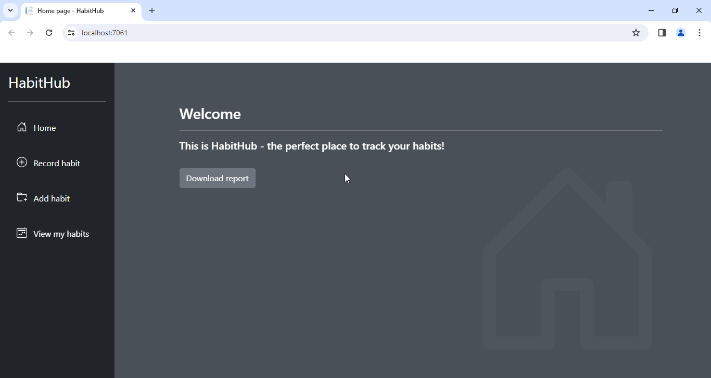
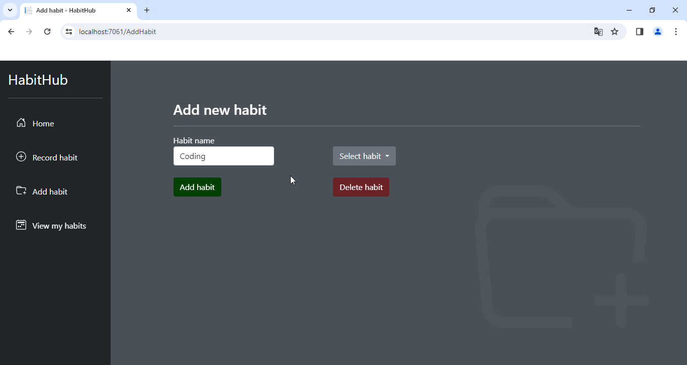
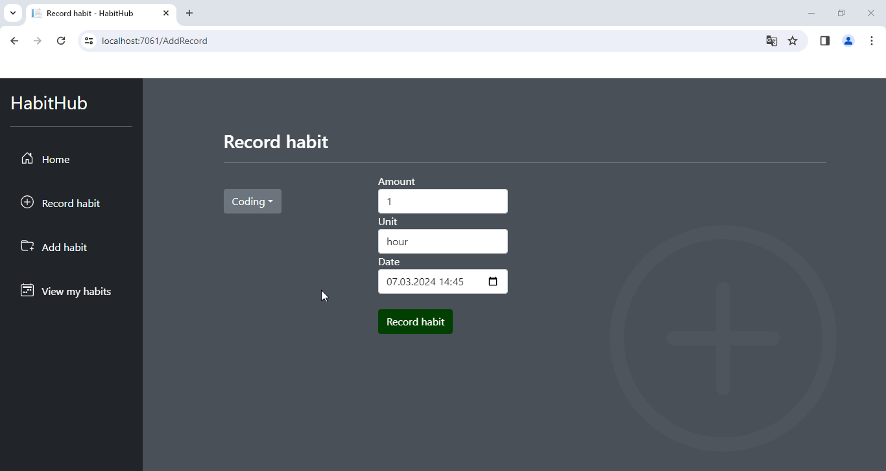
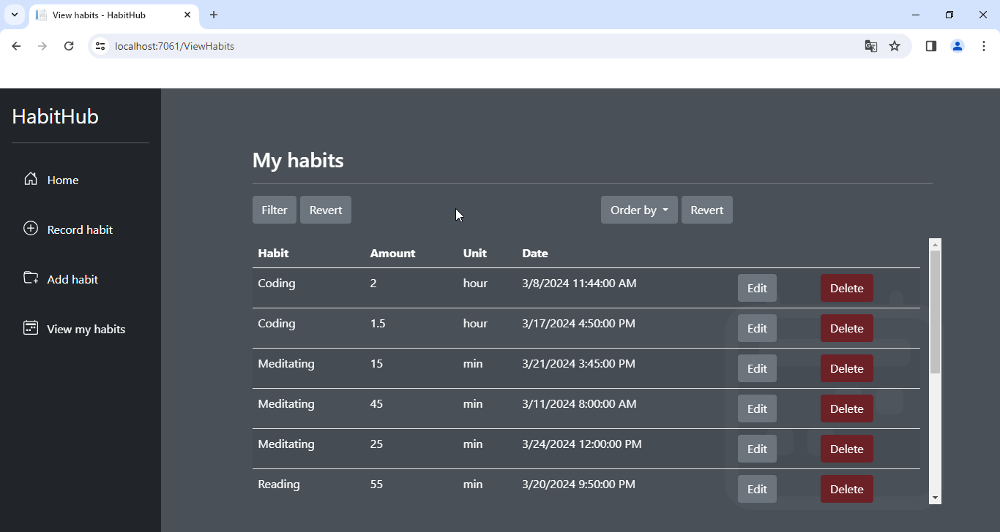
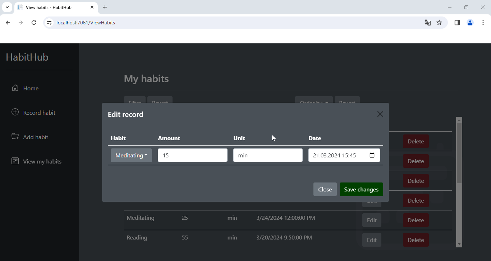
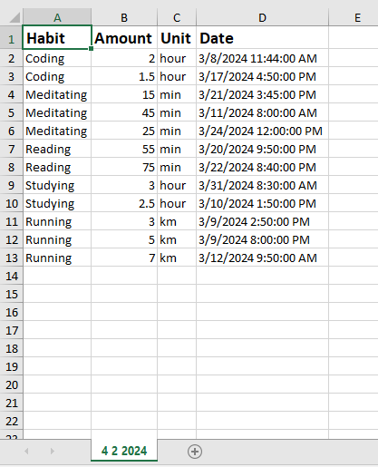
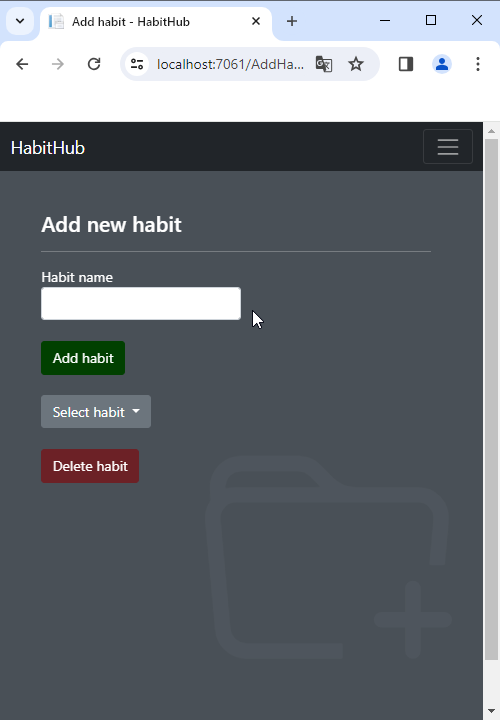

# **HabitHub**

"HabitHub" is a full-stack web application that allows you to track and monitor habits of your choice.

## **Technologies used**

The back-end side of the application is written in C#, using the ASP.NET framework with Razor Pages, ADO.NET and SQLite for data storage as well as EPPlus for Excel files manipulation.

The front-end is written in JavaScript, using Bootstrap for styling.

## **Features**

#### Adding new habits

To be able to monitor your habits, first you have to define what habits you are going to track. You can add a new habit (or delete an exisitng one) on the *Add habit* page (duplicates are not allowed).

#### Recording habits

Recording a new habit takes place on the *Record habit* page. Here you can choose one of the habits that you've added, set the amount and unit (i.e. 1 hour) and the date and time when you (presumably) finished the given activity.

#### Browsing recored habits

When you already have some habits recorded, you can view them on the *View my habits* page. Here you can also edit them as well as filter, order and sort the data to be able to analyze it better. 

- *Editing*. The *Edit* button opens a modal where you have full access to the whole record and can modify it as you please. You can also delete the record, clicking on the *Delete* button.

- *Filtering*. The *Filter* option opens a modal that allows you to filter the displayed records by:
    - Habit
    - From date (only records at this moment and later)
    - To date (only records at this moment or before)
    - From-to period (between the chosen moments, inclusive)

- *Ordering*. The *Order* dropdown allows to order the records either by habit or by date (in ascending order, by default). When applying this option, you can further sort the records in ascending or descending order, using the arrow buttons.

#### Downloading reports

On the home page of the application you can generate a report with all your recorded habits that will be downloaded as an Excel spreadsheet.

#### Responsiveness

The application is fully responsive and should display nicely on any device. The side navbar is converted to a top navbar for mobile screens and the buttons and tables scale and move accordingly to provide a comfortable navigation.

## **Main challenges**

When implementing the project I stumbled upon several challenges:

- _Filtering_. I didn't want to force the user to indicate too precisely the filtering criteria, so I decided to implement logic allowing to filter only by partial input. This meant that I had to check for all possible scenarios (filter or not by habit and/or filter or not by from date and/or filter or not by to date). It proved to be much less complicated thanks to the great LINQ queries.
- _Deleting habits_. One of my goals was to give the user full control over their data, which must have included deleting added habits. This, however, rose the problem of already stored records - if the habit used for these records was deleted, this change should be reflected in the data and the corresponding records should all be deleted. To solve this issue I modified the SQLite database to include the ON DELETE CASCADE constraint in the table storing the habits, making sure that all records that reference a particular habit would get deleted when the habit itself was deleted.
- _Date conversion_. In order to make the editing option clear and easy to use, I wanted to display in the edit modal all the data of the chosen record. It involved dynamically copying the record data with JavaScript and pasting it in the modal. However, the date and time conversion from a string to an HTML form shown in the modal proved to be quite complicated. I had to break down the string into single date components (year, month, day, hour, minutes), account for month zero-indexing, add leading zeros when necessary and build a new string that would eventually be displayed correclty in the modal.
- _Ordering_. First I thought of ordering the content of table with habit records on the back-end side of the app, using LINQ. That would be much simpler, but less user-friendly, since each time it would involve re-loading the whole page. So I opted for dynamic ordering using JavaScript. To accomplish this I wrote a set of functions that first: retrieve the habits (or dates) with their current row indexes in the table, convert them to a Map of key-value pairs and then to an array; second: sort the array (by habit or date) to get the new order of row indexes; third: create a temporary table (to avoid modifying the original one on the page) and populate it with ordered rows; fourth: populate the original table with the ordered content of the temporary table.

## **Credits**

Created by Wojciech Grodzicki.

- Initial back-end blueprint based on The C# Academy [tutorial](https://www.youtube.com/watch?v=iIFAKW21d-4).