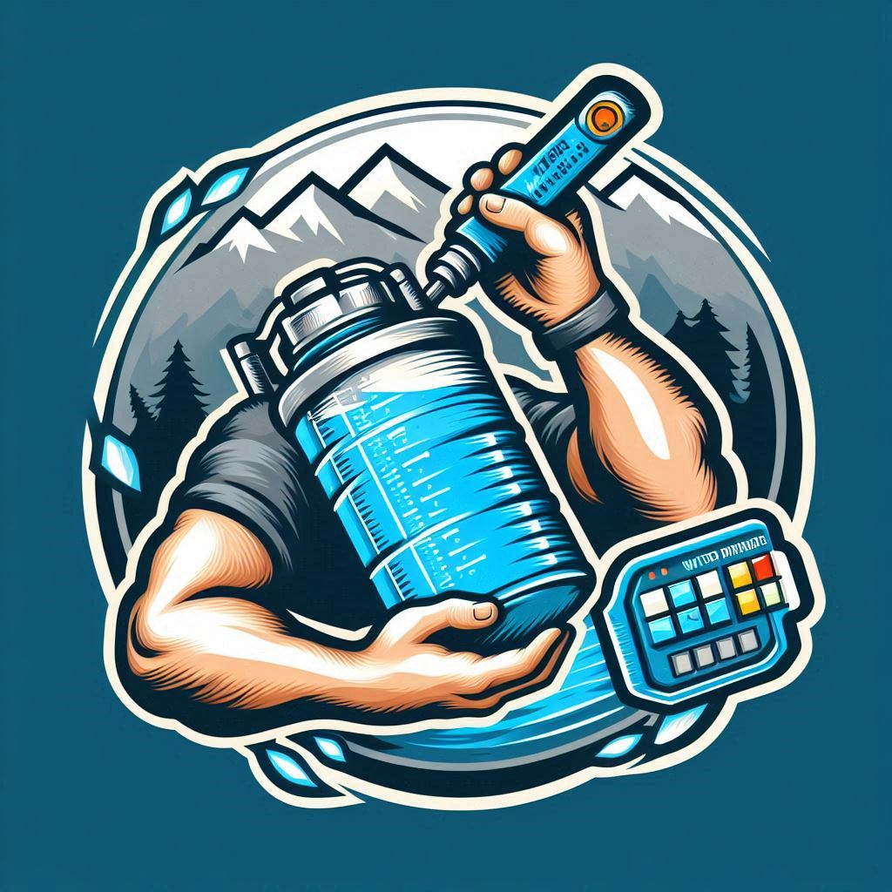
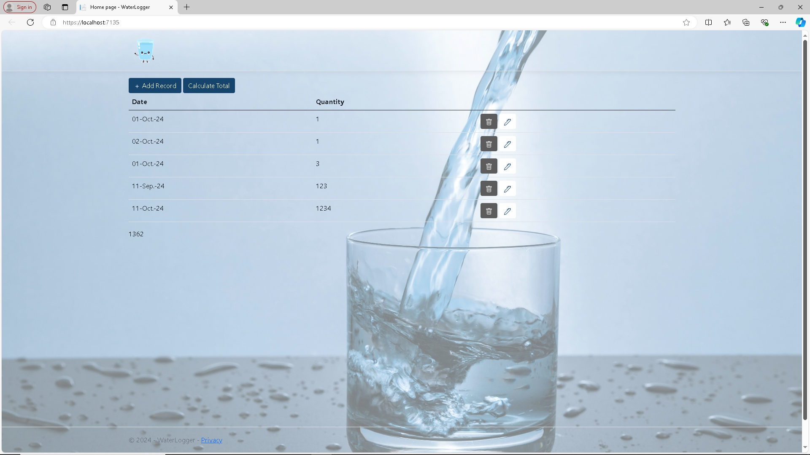
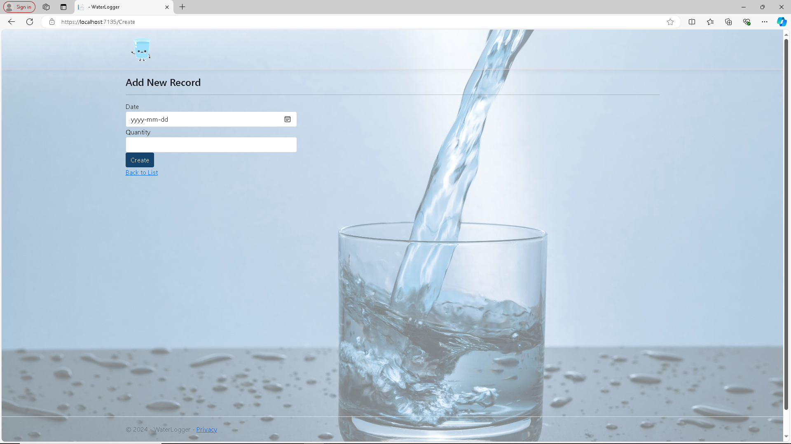
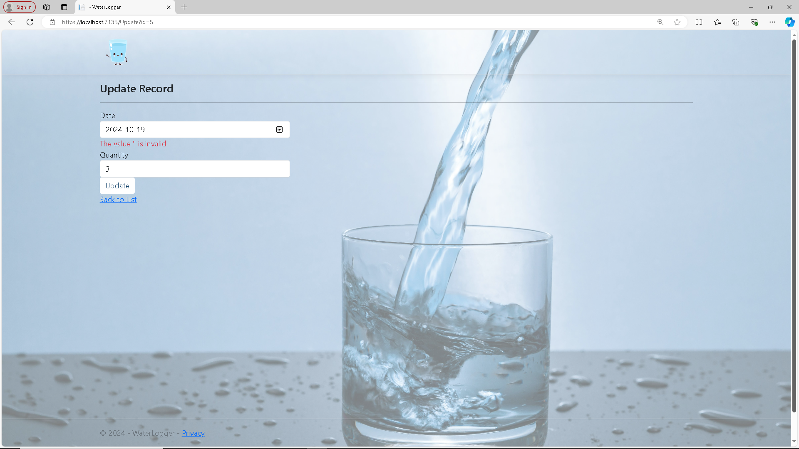
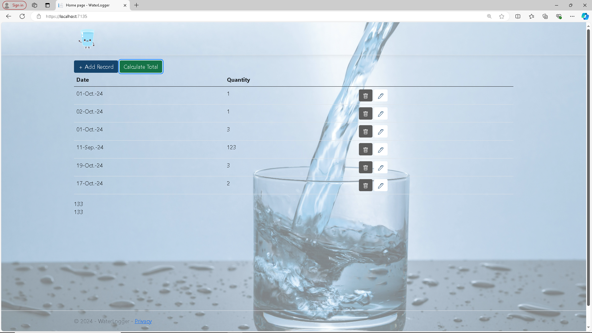

<h1>Water Drinking Logger</h1>

Welcome to the Water Drinking Logger App!

This app helps you log and track your water intake effectively. You can record daily water consumption and see the total amount of water you drank.

This is the C# MVC Project #1.

## Features

- **Water Consumption Tracking**: Log your daily water intake
- **Total Consumption**: See your total water intake

## Getting Started

### Prerequisites

- .NET 8 SDK installed on your system.

### Installation

#### Console

1. Clone the repository:
	- `git clone https://github.com/Jinboi/Water-Drinking-Logger.git`

2. Navigate to the project directory:
	- `cd src\\WaterLogger`

3. Run the application using the .NET CLI:
	- `dotnet run`

### Screenshots

This is the initial screen of the app when you start:

You can click on the Add New Record to add a new entry:

You can also click on the edit button to update a record:

Once you've updated a record, you can see that the total amount has changed.

You can click on the Calculate Total to see the total amount of water consumption:

## Room for Improvements

- Additional features such as reports to see water consumption per week/months/year
- Setting up daily water consumption goals and how far you are from reaching your goals

## Contributing

- Contributions are welcome! Please fork the repository and create a pull request with your changes. 
- For major changes, please open an issue first to discuss what you would like to change.

## License

- This project is licensed under the MIT License. See the [LICENSE](./LICENSE) file for details.

## Contact

- For any questions or feedback, please open an issue.

---
***Thank you and Happy Coding!***
